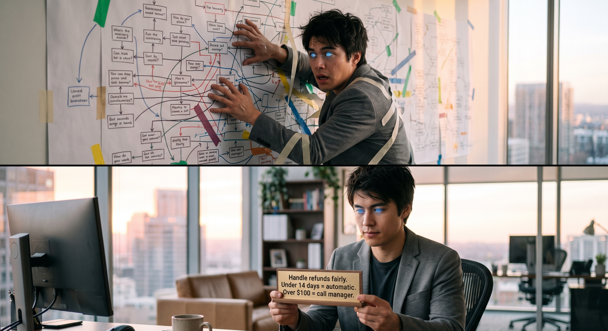
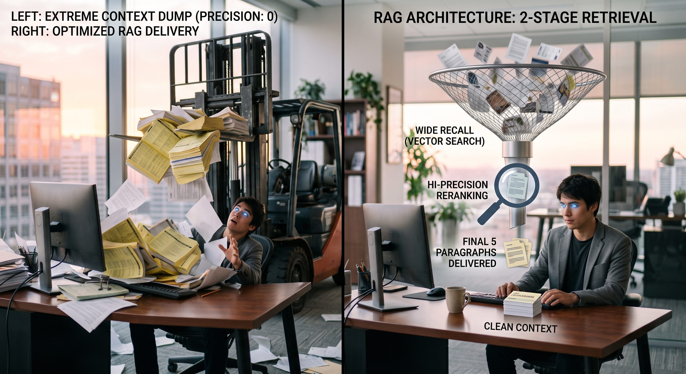
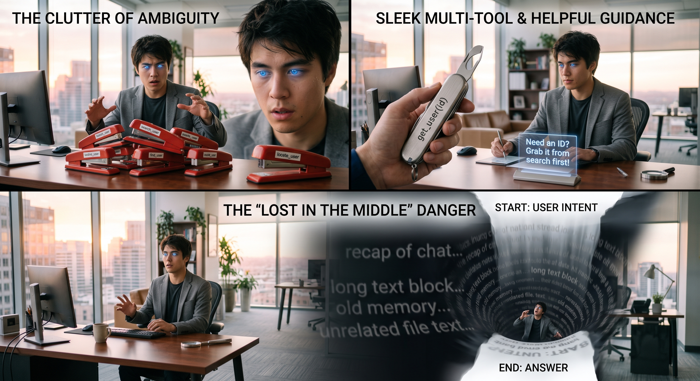
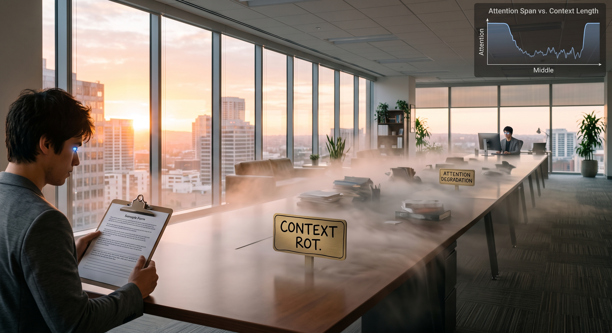

# 🧠 Context Engineering for Dummies 🚀

> 🌐 **Live Interactive Storyboard:** [https://rifaterdemsahin.github.io/context-engineering/](https://rifaterdemsahin.github.io/context-engineering/)

A complete 8-scene visual storyboard guide explaining why **Context Engineering** matters far more than prompt engineering, featuring core architectural concepts, memory patterns, RAG filtering, and MCP agent orchestration.

---

## 🎬 Visual Storyboard Overview

### 🤖 Scene 1: The Amnesiac Genius

- **💡 Key Principle:** LLMs possess high reasoning but zero persistent state between calls. Intelligence doesn't matter if the workspace is blank or disorganized.

---

### 📝 Scene 2: Prompting vs. 🗂️ Context Engineering

- **🔑 Key Principle:** Prompt engineering is writing the note. Context engineering is assembling the whole desk: System Note, Documents, Memory, and Tools.

---

### 🧭 Scene 3: The Task Note — Principles vs. Mazes

- **🔑 Key Principle:** Avoid the instruction maze. Frame roles with concise principles + hard guardrails rather than 50 lines of nested conditional logic.

---

### 🎯 Scene 4: The Right Documents — Precision RAG

- **🔑 Key Principle:** `candidates = search(k=50) → rerank(candidates)[:5]`. Cast wide for recall, rerank for precision. Keep the desk clear of stale indices.

---

### 📓 Scene 5: The Notebook in the Drawer

- **🔑 Key Principle:** Short-term memory = Compaction (keep last 10 turns + summary). Long-term memory = External notebook files outside the active context.

---

### 🛠️ Scene 6: Tools & Self-Correcting Errors

- **🔑 Key Principle:** One clear contract per tool. Write errors designed for LLMs (hinting the next logical step) instead of cryptic human exceptions.

---

### 🌫️ Scene 7: The "Lost in the Middle" Trap

- **🔑 Key Principle:** Assemble context dynamically: filter before ingestion, and position high-priority directives at the primacy and recency edges.

---

### 🔌 Scene 8: Standardized Desk & Orchestration

- **🔑 Key Principle:** *"AI's problem was never intelligence. It's what gets put on the desk."* Master the desk, and you master the agent.

---

## 💻 Local Preview

Open `index.html` directly in any web browser or serve with:

```bash
npx serve .
```

Visit [https://rifaterdemsahin.github.io/context-engineering/](https://rifaterdemsahin.github.io/context-engineering/) for the live GitHub Pages deployment.
